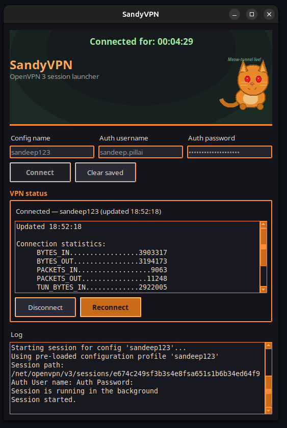

# SandyOVPN

**One Click OpenVPN 3 Manager for Linux**

Tired of typing `openvpn3 session-start`, entering your username, waiting, then doing it all again every hour when working form home? 


SandyOVPN is a small Linux desktop app that turns your VPN into seamless one-click — with a live connection dashboard, encrypted saved credentials, and a funny ginger cat to remind you to stop scrolling reels!



## Why SandyOVPN?

**One Single Click!**  
Save your profile once. Hit Connect every day you login. SandyOVPN handles the rest.

**Easy to Install**

The install bash script will set everything up for you. All you need is to drag and drop your ovpn file ONCE!

**See your session at a glance.**  
A live timer, real-time stats, and one-click Disconnect or Reconnect — no tabbing back to slack to copy your password!

**Secure**  
Passwords are securely encrypted on disk and NOT stored in the RAM during runtime. Your credentials aren't sitting in plain text waiting for the russian hacker.

**Kawai**  
Dark UI, orange accents, a soft green glow when you’re connected, and a mascot that dozes off when the VPN’s down. 

## What you get

- One-click connect to any imported OpenVPN 3 profile
- Encrypted credential storage (save once, connect many times)
- Live **Connected for** timer and session statistics
- Disconnect & reconnect without reopening a terminal, especially useful when working from home!
- Sleepy ginger cat to keep you company, with a new pun every launch 🐈

---

## Requirements

- Linux with [OpenVPN 3](https://openvpn.net/community-docs/openvpn-client-for-linux.html) installed (`openvpn3` on your `PATH`)
- Python 3.10+ (auto installed if missing)

```bash
sudo apt install python3 python3-tk python3-venv
```

# Install

```bash
git clone https://github.com/sanpai42/sandyOVPN

cd sandyOVPN
sudo bash ./install.sh

```

That sets up a virtual environment, installs dependencies, and adds **SandyOVPN** to your application menu and Desktop. IF you have openvpn, it gets upgraded to openvpn3 with your consent.

## Run

Open **SandyOVPN** from your app launcher / menu!


---

**Quick start:** enter your config name, username, and password → **Save credentials** (first time) → **Connect**. Next time, just click Connect and go.


Security Note: Built for personal use on a trusted Linux machine ONLY. Credentials are encrypted using secure AES-128-CBC at rest; decrypt happens only when you connect and is not retained in RAM. 

KNOWN Bugs:

If your ovpn file is in a secure folder that needs sudo access, you might not be able to drag and drop the file. Try moving it into the project folder or launching this app as sudo, or try using the ugly file selector instead.


*So long, and thanks for all the fish! 🐬*
